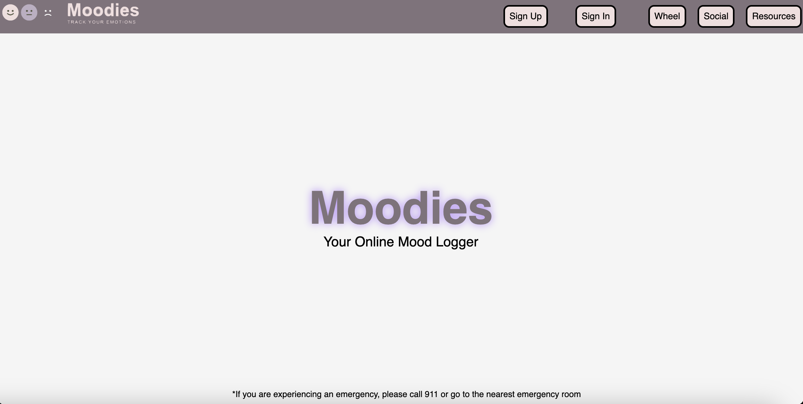

# Moodies




This is the front-end for Moodies, a full-stack MERN application that allows users to track their moods over time. Users may track their moods, the date of the mood, the intensity of the mood, the physical experience of the mood, and any additional notes the user may want to log. 

The backend serves as the API layer for the frontend.  
🖥️ Backend Repository: [Moodies Backend](https://github.com/DylanTai/Moodies-Backend/tree/dev)

🗂️ Planning materials: [Trello Board](https://trello.com/b/QhxB4rwY/moodies-mern-stack-crud-app-group-project)

## 🧭 Features

- Track and view your moods over time  
- Log the **date**, **intensity**, **physical experience**, and **notes** for each mood  
- Browse a feed of all logged moods  
- Clean, minimal UI focused on reflection and mental health awareness  


## 🟢 Getting Started

### ✅ Pre-requisites

- Node.js & npm
- React
- A running instance of the [Moodies Backend](https://github.com/DylanTai/Moodies-Backend/tree/dev)

### ⚙️ Installation

1. **Fork and Clone the Repo**

```
git clone <repo>
cd <cloned repo>
```

2. **Install Dependencies**

```
npm install

```

3. **Create .env File**

Create a .env file and link to your backend API

```
VITE_BACK_END_SERVER_URL= <your-backend-url-here>
```

4. **Start Your Server**

```
npm run dev
```

## 💻 Technologies Used

Frontend:

- React (Vite)

- React Router

- Context API

- CSS / Flexbox / Grid

Backend:

- Node.js

- Express

- MongoDB / Mongoose

## 🌱 Stretch Goals

- AAU, I'd like to log moods other than the ones provided in the drop down menu
- AAU, it would be cool to visualize my moods over time in a graph or chart
- AAU, I'd like to be able to reset my password or delete my account


## 📝 License

This project is for educational purposes as part of a MERN stack group project.

## 🤝 Contributors

- [Daequan Sessíon](https://github.com/daequansession)
- [Dylan Tai](https://github.com/DylanTai)
- [Sara Mattina](https://github.com/saramattina)